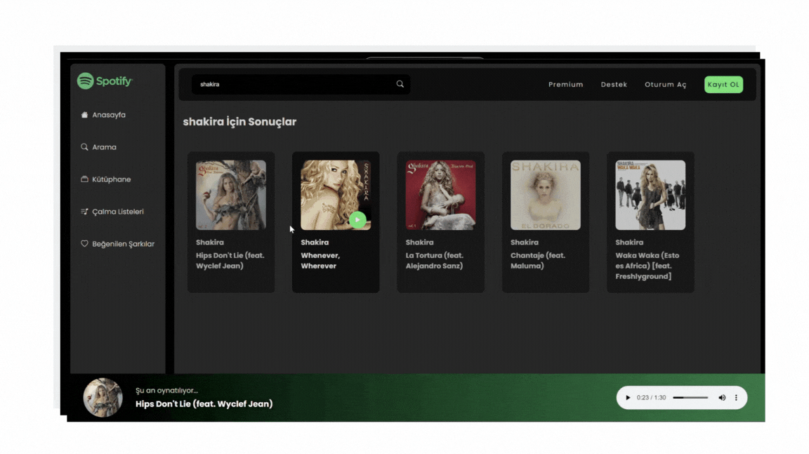

# Spotify Clone

# Teknolojiler

- HTML
- CSS
- JS

# Özellikler

- Popüler Müzik Listeleme: Müzik listelerinden seçilen popüler şarkıları gerçek zamanlı olarak gösterir.
- Arama Fonksiyonu: Kullanıcıların anahtar kelime kullanarak belirli şarkıları aramasına olanak tanır ve ilgili sonuçları gösterir.
- Şu Anda Çalan Şarkının Bilgileri: Çalan şarkının ayrıntılarını, albüm kapağını ve başlığını gösterir.

# GIF

